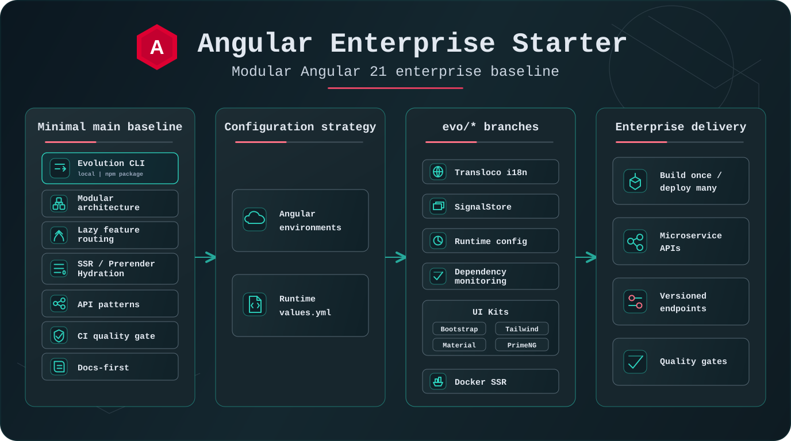
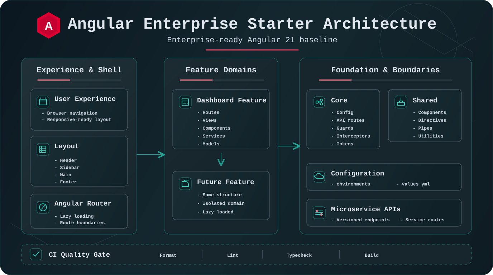

<p align="center">
  <a href="https://angular.dev/" aria-label="Angular">
    
  </a>
</p>

# Angular Enterprise Starter



[](https://github.com/FilippoLacagnina/angular-enterprise-starter/actions/workflows/ci.yml)
[](https://github.com/FilippoLacagnina/angular-enterprise-starter/releases)
[](./LICENSE)
[](https://angular.dev/)

[](https://angular-enterprise-starter-builder.onrender.com/)
[](https://www.npmjs.com/package/@filippolacagnina/angular-enterprise-starter)

**Available Evolutions**


**WIP Evolutions**


Angular Enterprise Starter is an enterprise-ready Angular 21 baseline for building scalable applications from a minimal, documented and composable foundation.

The `main` branch stays intentionally clean. Teams can adopt it as-is, then add only the capabilities they need through optional evolution paths—without inheriting a fixed all-in-one stack.

> [!IMPORTANT]
> Use the Interactive Builder to compose a tailored starter through a guided visual workflow. Clone `main` directly when you want the cleanest baseline and full manual control.

## Why This Starter

- Enterprise-oriented structure without a UI library or state-management lock-in.
- Angular 21 standalone architecture with SSR, prerendering and hydration.
- Clear boundaries for application infrastructure, reusable code, layout and business features.
- Build-time environments for `local`, `dev`, `test` and `prod`.
- HTTP conventions with correlation IDs and centralized error handling.
- Strict linting, formatting, tests, documentation checks and CI quality gates.
- Optional, independently installable evolutions for common enterprise capabilities.
- Post-clone cleanup tooling for converting the starter into a focused product repository.

## Baseline at a Glance

- Intentionally minimal and unstyled application shell.
- Standalone `Header`, `Sidebar`, `Main` and `Footer` layout components.
- Enterprise folders scaffolded under `core`, `shared`, `layout` and `features`.
- Root route redirected to a lazy-loaded `/dashboard` feature.
- Angular environments configured for local development and delivery targets.
- Browser and Node server bundles generated by the Angular SSR build.
- Example API route and service patterns that can be removed or replaced.

## Choose How to Start

The Builder and the repository are two first-class entry points to the same Angular Enterprise Starter foundation.

### Compose Visually with the Interactive Builder

> [!TIP]
> **Recommended for discovering and composing the starter.**
>
> [Open the Interactive Builder](https://angular-enterprise-starter-builder.onrender.com/)

The Builder turns the starter catalog into a guided project-generation experience:

- select the clean enterprise baseline;
- choose compatible available evolutions;
- configure the options supported by each installer;
- preview the evolution plan and generated project structure;
- inspect generated text files;
- generate and download a cleaned, neutral project archive.

```text
select baseline -> choose evolutions -> configure -> preview -> generate -> download
```

Supported installations are delegated to a pinned version of the Evolution CLI, keeping visual generation aligned with the same validated installer contracts. The CLI remains independently usable for local and automated workflows.

### Start from the Clean `main` Baseline

```bash
git clone git@github.com:FilippoLacagnina/angular-enterprise-starter.git
cd angular-enterprise-starter
npm install
npm run start
```

`npm run start` uses the `local` environment by default.

To verify the production SSR bundle:

```bash
npm run build
npm run serve:ssr
```

## Architecture



```text
src/app/
  core/       # singleton infrastructure and cross-cutting concerns
  shared/     # reusable building blocks
  layout/     # global application shell
  features/   # lazy business areas
```

A feature keeps its routes and implementation together:

```text
features/orders/
  orders.routes.ts
  views/
  components/
  services/
  models/
```

See [Architecture Guidelines](./docs/architecture.md) for boundaries, naming and dependency rules.

## Configuration Strategy

Choose the configuration model before adapting the starter to a real product.

| Strategy                           | Starting point              | Best for                                                                |
| ---------------------------------- | --------------------------- | ----------------------------------------------------------------------- |
| Angular environment files          | `main`                      | Build-time configuration and projects that rebuild for each target.     |
| Runtime `assets/config/values.yml` | `evo/config/runtime-config` | Deploy-time configuration, containers and build-once deploy-many flows. |

The runtime configuration model is an optional evolution; it does not change projects that do not select it. Avoid managing the same value through both strategies unless the architecture explicitly requires it.

See [Configuration](./docs/configuration.md) and the [Runtime Config evolution](./docs/evolutions/runtime-config.md).

## Optional Evolutions

Evolutions extend the starter without changing the minimal contract of `main`. The three delivery paths serve different stages of adoption:

| Path                | Role                                                                          |
| ------------------- | ----------------------------------------------------------------------------- |
| Interactive Builder | Visually compose and export a new project from the starter foundation.        |
| Evolution CLI       | Preview and apply versioned evolutions to a local workspace.                  |
| `evo/*` branch      | Inspect or manually merge the complete reference implementation of an option. |

The complete source of truth for implemented branches, planned work and compatibility is the [Evolutions Catalog](./docs/evolutions.md).

### Evolution CLI

The Evolution CLI previews the impact before applying an installer, validates the workspace and stops on ambiguous or unsafe states.

| Usage mode           | Command                                                            |
| -------------------- | ------------------------------------------------------------------ |
| Local starter clone  | `npm run starter:evolution`                                        |
| npm `latest`         | `npx @filippolacagnina/angular-enterprise-starter evolution`       |
| Explicit alpha track | `npx @filippolacagnina/angular-enterprise-starter@alpha evolution` |


| Principle           | Contract                                                               |
| ------------------- | ---------------------------------------------------------------------- |
| Preview first       | Show files and dependency changes before touching the workspace.       |
| Apply safely        | Refuse destructive overwrites and ambiguous project states.            |
| Parametrize choices | Request explicit project context instead of assuming it.               |
| Remain repeatable   | Detect compatible existing setup and reject conflicting partial setup. |

Current CLI installers:

| Installer      | Purpose                                                                                    |
| -------------- | ------------------------------------------------------------------------------------------ |
| Transloco      | Runtime i18n with configurable languages, default/fallback and generated assets.           |
| Runtime Config | Deployable YAML configuration with preview, apply and safety guards.                       |
| SignalStore    | Feature or root stores with safe target detection and provider registration.               |
| Docker SSR     | Container baseline for the generated Angular Node server.                                  |
| Bootstrap      | Bootstrap setup and selected starter-owned UI wrapper components.                          |
| Tailwind       | Tailwind CSS setup and selected starter-owned UI wrapper components.                       |
| AI Genkit      | Server-side, multi-provider-ready Genkit foundation with Gemini and opt-in typed examples. |

The evolution catalog is manifest-backed so help, parsing, validation, packaging and documentation
share the same identifiers. For tooling integrations such as the Interactive Builder, the npm
package also exposes two versioned design-system contracts: semantic component metadata and the
actual runtime sources generated by the Bootstrap and Tailwind installers. See the
[Evolution CLI overview](./docs/schematics.md#public-design-system-contracts) and
[installer guides](./docs/evolution-cli/README.md).

## Adopting the Starter

After cloning the repository for a real product, preview starter-only files that can be removed:

```bash
npm run starter:cleanup
```

Apply the reviewed cleanup:

```bash
npm run starter:cleanup:apply
```

The cleanup preserves the project license, README, package metadata and technical documentation.

When a product repository should no longer contain local installer sources, use consumer mode:

```bash
npm run starter:cleanup:consumer
```

The published CLI remains available afterward through the versioned npm package.

## Essential Scripts

| Command                            | Purpose                                                   |
| ---------------------------------- | --------------------------------------------------------- |
| `npm run start`                    | Start the local development server.                       |
| `npm run build`                    | Generate production browser and server bundles.           |
| `npm run serve:ssr`                | Run the generated SSR server after a build.               |
| `npm run test`                     | Run Angular tests.                                        |
| `npm run lint`                     | Run ESLint checks.                                        |
| `npm run format:check`             | Verify Prettier formatting.                               |
| `npm run docs:check`               | Validate documentation structure and local links.         |
| `npm run schematics:test`          | Run Evolution CLI installer tests.                        |
| `npm run starter:evolution`        | Open the guided Evolution CLI.                            |
| `npm run starter:cleanup`          | Preview removable starter-only files.                     |
| `npm run starter:cleanup:apply`    | Apply the reviewed starter cleanup.                       |
| `npm run starter:cleanup:consumer` | Remove local installer tooling from a product repository. |

Environment-specific commands such as `start:dev`, `build:test` and `build:prod` are documented in [Configuration](./docs/configuration.md).

## Documentation

| Area                 | Guide                                                |
| -------------------- | ---------------------------------------------------- |
| Architecture         | [Architecture Guidelines](./docs/architecture.md)    |
| Configuration        | [Configuration](./docs/configuration.md)             |
| API conventions      | [API Contracts](./docs/api.md)                       |
| Routing and SSR      | [Routing and SSR](./docs/routing.md)                 |
| State management     | [State Management](./docs/state-management.md)       |
| Testing              | [Testing Strategy](./docs/testing.md)                |
| Evolutions           | [Evolutions Catalog](./docs/evolutions.md)           |
| Evolution CLI        | [CLI Overview](./docs/schematics.md)                 |
| CLI installer guides | [Operational Guides](./docs/evolution-cli/README.md) |
| Versioning           | [Versioning](./docs/versioning.md)                   |
| Project status       | [Current Status](./docs/current-status.md)           |
| Roadmap              | [Roadmap](./ROADMAP.md)                              |
| Release history      | [Changelog](./CHANGELOG.md)                          |

## Community

- [Contributing Guidelines](./CONTRIBUTING.md)
- [Security Policy](./SECURITY.md)
- [Code of Conduct](./CODE_OF_CONDUCT.md)
- [Pull Request Template](./.github/pull_request_template.md)

## Alpha Status

The current release candidate is `v0.8.0-alpha.0`.

The Angular application remains marked as `private` to prevent accidental npm publication. The Evolution CLI is packaged and published separately.

Before using the starter in a product, review and adapt demonstrative code such as `dashboard-api.routes.ts` and `DashboardService`.

## Trademark Notice

Angular and the Angular logo are trademarks of Google LLC.
The Angular logo is used from the official Angular Press Kit under CC BY 4.0.
This project is not affiliated with or endorsed by Google or the Angular team.
