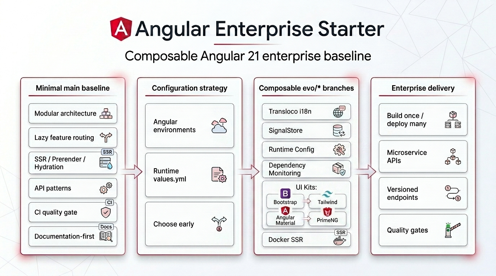
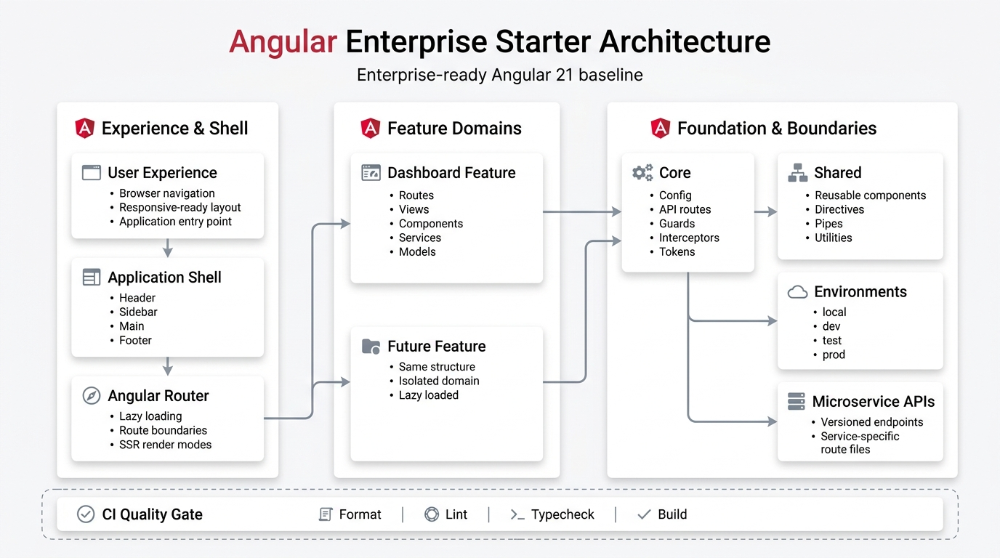

<p align="center">
  <a href="https://angular.dev/" aria-label="Angular">
    
  </a>
</p>

# Angular Enterprise Starter



[](https://github.com/FilippoLacagnina/angular-enterprise-starter/actions/workflows/ci.yml)
[](https://github.com/FilippoLacagnina/angular-enterprise-starter/releases)
[](./LICENSE)
[](https://angular.dev/)

**Available Evolutions**


**WIP Evolutions**


Angular Enterprise Starter is an enterprise-ready Angular 21 starter template for building scalable Angular applications with modular architecture, SSR support, environment configuration or runtime configuration, API patterns, CI and documentation-first conventions.

The starter keeps `main` minimal and provides optional `evo/*` branches for additional capabilities such as i18n, runtime configuration, testing, design systems, deployment, tooling, state management and authentication.

> [!IMPORTANT]
> See [Evolutions](./docs/evolutions.md) for the full branch catalog, implemented variants, planned variants and maintenance rules.

> [!IMPORTANT]
> Start from `main` or from any implemented `evo/*` branch, then merge additional compatible evolutions to compose your own project baseline.

> [!IMPORTANT]
> Choose the configuration strategy early: start from `main` for Angular environment files, or start from `evo/config/runtime-config` for deployable runtime configuration through `assets/config/values.yml`.

The goal is to provide a clean, documented and composable Angular baseline with modern APIs, lazy feature routing, strict tooling, environment or runtime configuration, clear architectural boundaries and optional evolutions for project-specific needs.

Current release:

```text
v0.2.0-alpha.0 - Evolution branches and runtime configuration baseline
```

Current evolution branches:

| Branch                               | Description                         |
| ------------------------------------ | ----------------------------------- |
| `evo/i18n/transloco`                 | Transloco runtime i18n baseline     |
| `evo/config/runtime-config`          | Runtime YAML configuration baseline |
| `evo/design-system/tailwind`         | Tailwind CSS styling baseline       |
| `evo/design-system/primeng`          | PrimeNG component baseline          |
| `evo/design-system/angular-material` | Angular Material component baseline |
| `evo/design-system/bootstrap`        | Bootstrap styling baseline          |
| `evo/deployment/docker-ssr`          | Docker SSR deployment baseline      |
| `evo/state/signal-store`             | NgRx SignalStore state baseline     |
| `evo/tooling/dependency-monitoring`  | Dependency monitoring report        |

## Why This Starter

- Enterprise-oriented architecture without UI library lock-in.
- Angular 21 baseline with standalone APIs and modern application setup.
- SSR, prerender and hydration strategy documented from the beginning.
- Environment configuration for `local`, `dev`, `test` and `prod`.
- Runtime configuration through deployable `assets/config/values.yml`.
- API route conventions designed for multiple microservices and versioned endpoints.
- Optional `evo/*` branches for composable add-ons without forcing every project into the same stack.
- Optional maintenance tooling for monitoring dependencies across `main` and evolution branches.
- Simple, detailed documentation focused on Angular and enterprise best practices.
- Post-clone cleanup workflow for adapting the starter to a real product repository.

## Configuration Strategy

Choose the configuration model before starting a real project.

| Strategy                           | Recommended starting point  | Best for                                                                 |
| ---------------------------------- | --------------------------- | ------------------------------------------------------------------------ |
| Angular environment files          | `main`                      | build-time configuration, simpler apps, projects that rebuild per target |
| Runtime `assets/config/values.yml` | `evo/config/runtime-config` | deploy-time configuration, Docker, CI/CD, build-once deploy-many flows   |

Both approaches are documented and visible on purpose.
Avoid keeping both strategies active for the same values unless there is a clear architectural reason.

## Current Baseline

- public alpha release: `v0.2.0-alpha.0`
- based on Angular 21
- intentionally minimal and unstyled
- layout placeholders only (`Header`, `Sidebar`, `Main`, `Footer`)
- no layout CSS classes in templates
- empty layout SCSS files for future customization
- enterprise folders already scaffolded (`core`, `shared`, `layout`, `features`)
- root route redirects to `/dashboard`
- dashboard feature is lazy-loaded
- application config supports `local`, `dev`, `test` and `prod`

## Architecture Preview



```text
src/app/
  core/       # singleton infrastructure and cross-cutting concerns
  shared/     # reusable building blocks
  layout/     # global shell components
  features/   # lazy business areas
```

Feature example:

```text
features/orders/
  orders.routes.ts
  views/
  components/
  services/
  models/
```

See [Architecture Guidelines](./docs/architecture.md) for the full recommended structure.

## Getting Started

```bash
git clone git@github.com:FilippoLacagnina/angular-enterprise-starter.git
cd angular-enterprise-starter
npm install
npm run start
```

By default, `npm run start` uses the `local` environment.

If you start from `evo/config/runtime-config`, the app loads `/assets/config/values.yml` instead of Angular environment files.

After cloning it for a real product, preview starter-only files that can be removed:

```bash
npm run starter:cleanup
```

Apply cleanup only when you are ready:

```bash
npm run starter:cleanup:apply
```

The cleanup script removes starter community and planning files only.
It does not remove `LICENSE`, `README.md`, `package.json` or technical documentation.

## Optional Evolutions

The `main` branch is the minimal, non-opinionated baseline.

Optional capabilities are provided or planned as dedicated evolution branches, so consumers can start from a richer variant when they need a specific setup.
These branches are an important part of the starter strategy and should be reviewed before choosing the baseline for a new project.
Teams can choose one implemented evolution branch as a starting point and merge other compatible evolutions later, instead of adopting a fixed all-in-one starter.

Examples:

```bash
git clone --branch evo/i18n/transloco git@github.com:FilippoLacagnina/angular-enterprise-starter.git
git clone --branch evo/design-system/tailwind git@github.com:FilippoLacagnina/angular-enterprise-starter.git
git clone --branch evo/design-system/bootstrap git@github.com:FilippoLacagnina/angular-enterprise-starter.git
git clone --branch evo/state/signal-store git@github.com:FilippoLacagnina/angular-enterprise-starter.git
git clone --branch evo/tooling/dependency-monitoring git@github.com:FilippoLacagnina/angular-enterprise-starter.git
```

Evolution branches are designed to be composable when possible.
For example, a project can start from a design system branch and later merge an i18n evolution branch.

Evolution branches are not versioned independently.
Each implemented evolution declares the `main` baseline version it is compatible with.

Some evolution branches are still work in progress and should be reviewed before being used as a production baseline.

> [!IMPORTANT]
> See [Evolutions](./docs/evolutions.md) for the full branch catalog, implemented variants, planned variants and maintenance rules.

## Scripts

```bash
npm run start
npm run start:local
npm run start:dev
npm run start:test
npm run build
npm run build:local
npm run build:dev
npm run build:test
npm run build:prod
npm run serve:ssr
npm run test
npm run lint
npm run lint:fix
npm run format
npm run format:check
npm run starter:cleanup
npm run starter:cleanup:apply
```

Environment scripts:

- `npm run start` and `npm run start:local`: start the app with the `local` environment.
- `npm run start:dev`: start the app with the shared `dev` environment.
- `npm run start:test`: start the app with the `test` environment.
- `npm run build`: build using Angular's default production configuration.
- `npm run build:local`: build with the `local` environment.
- `npm run build:dev`: build with the shared `dev` environment.
- `npm run build:test`: build with the `test` environment.
- `npm run build:prod`: build with the `prod` environment.

Runtime configuration:

- `evo/config/runtime-config`: deploy-time values are selected by replacing `assets/config/values.yml`, not by Angular environment file replacements.

To test the generated SSR/server bundle locally:

```bash
npm run build
npm run serve:ssr
```

## Documentation

- [Architecture Guidelines](./docs/architecture.md)
- [Configuration](./docs/configuration.md)
- [API Contracts](./docs/api.md)
- [Routing and SSR](./docs/routing.md)
- [State Management](./docs/state-management.md)
- [Testing Strategy](./docs/testing.md)
- [Evolutions](./docs/evolutions.md)
- [Versioning](./docs/versioning.md)
- [Current Status](./docs/current-status.md)
- [Roadmap](./ROADMAP.md)
- [Changelog](./CHANGELOG.md)

## Runtime Config Documentation

Use these guides when choosing `evo/config/runtime-config`.

- [Architecture](https://github.com/FilippoLacagnina/angular-enterprise-starter/blob/evo/config/runtime-config/docs/runtime-config/architecture.md)
- [Configuration](https://github.com/FilippoLacagnina/angular-enterprise-starter/blob/evo/config/runtime-config/docs/runtime-config/configuration.md)
- [Flow](https://github.com/FilippoLacagnina/angular-enterprise-starter/blob/evo/config/runtime-config/docs/runtime-config/flow.md)
- [API Usage](https://github.com/FilippoLacagnina/angular-enterprise-starter/blob/evo/config/runtime-config/docs/runtime-config/api.md)
- [State Usage](https://github.com/FilippoLacagnina/angular-enterprise-starter/blob/evo/config/runtime-config/docs/runtime-config/state-management.md)

## Evolution Documentation

- [Transloco Evolution](https://github.com/FilippoLacagnina/angular-enterprise-starter/blob/evo/i18n/transloco/docs/i18n-transloco.md)
- [Runtime Config Evolution](https://github.com/FilippoLacagnina/angular-enterprise-starter/blob/evo/config/runtime-config/docs/runtime-config.md)
- [PrimeNG Evolution](https://github.com/FilippoLacagnina/angular-enterprise-starter/blob/evo/design-system/primeng/docs/primeng.md)
- [Tailwind Evolution](https://github.com/FilippoLacagnina/angular-enterprise-starter/blob/evo/design-system/tailwind/docs/tailwind.md)
- [Angular Material Evolution](https://github.com/FilippoLacagnina/angular-enterprise-starter/blob/evo/design-system/angular-material/docs/angular-material.md)
- [Bootstrap Evolution](https://github.com/FilippoLacagnina/angular-enterprise-starter/blob/evo/design-system/bootstrap/docs/bootstrap.md)
- [Docker SSR Evolution](https://github.com/FilippoLacagnina/angular-enterprise-starter/blob/evo/deployment/docker-ssr/docs/docker-ssr.md)
- [Signal Store Evolution](https://github.com/FilippoLacagnina/angular-enterprise-starter/blob/evo/state/signal-store/docs/signal-store.md)
- [Dependency Monitoring Evolution](https://github.com/FilippoLacagnina/angular-enterprise-starter/blob/evo/tooling/dependency-monitoring/docs/dependency-monitoring.md)

## Community

- [Contributing Guidelines](./CONTRIBUTING.md)
- [Security Policy](./SECURITY.md)
- [Code of Conduct](./CODE_OF_CONDUCT.md)
- [Pull Request Template](./.github/pull_request_template.md)

## Alpha Notes

The repository is public and currently in alpha pre-release.
The package remains marked as `private` to prevent accidental npm publication.

Before the first stable release:

- review documentation and examples
- remove or adapt demonstrative examples such as `dashboard-api.routes.ts` and `DashboardService`

## Trademark Notice

Angular and the Angular logo are trademarks of Google LLC.
The Angular logo is used from the official Angular Press Kit under CC BY 4.0.
This project is not affiliated with or endorsed by Google or the Angular team.
