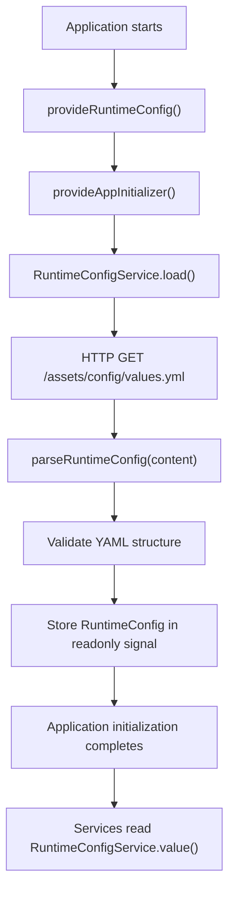
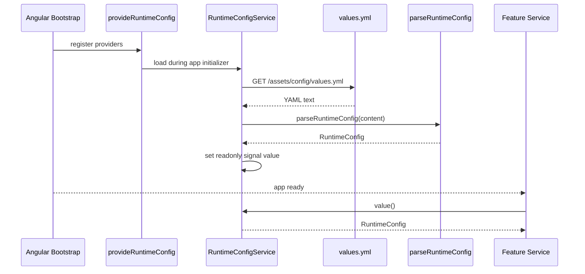

# Runtime Config Flow

## Index

- [High-level flow](#high-level-flow)
- [Bootstrap sequence](#bootstrap-sequence)
- [Provider responsibilities](#provider-responsibilities)
- [Service responsibilities](#service-responsibilities)
- [Parser responsibilities](#parser-responsibilities)
- [SSR URL resolution](#ssr-url-resolution)
- [Consumer usage](#consumer-usage)
- [Failure behavior](#failure-behavior)

## High-level flow



The runtime config is loaded before the application finishes initialization.
This makes configuration errors fail early instead of surfacing later inside feature code.

## Bootstrap sequence



## Provider responsibilities

File:

```text
src/app/core/runtime-config/runtime-config.provider.ts
```

Responsibilities:

- register the runtime config path token;
- register `provideAppInitializer`;
- call `RuntimeConfigService.load()` during application startup.

The provider keeps bootstrap wiring outside the service implementation.

## Service responsibilities

File:

```text
src/app/core/runtime-config/runtime-config.service.ts
```

Responsibilities:

- read the runtime config path from `RUNTIME_CONFIG_PATH`;
- load `values.yml` as text through `HttpClient`;
- support browser and SSR URL resolution;
- delegate YAML parsing and validation to the parser;
- store the parsed config in a private signal;
- expose a readonly signal through `config`;
- expose an imperative `value()` accessor for services.

The service owns loading and state, not validation rules.

## Parser responsibilities

File:

```text
src/app/core/runtime-config/runtime-config.parser.ts
```

Responsibilities:

- parse YAML text;
- normalize unknown input into the `RuntimeConfig` contract;
- validate required top-level sections;
- validate `app.name`;
- validate `app.environment`;
- validate each API `baseUrl`;
- fail fast with explicit errors when config is invalid.

The parser does not perform HTTP calls and does not store state.

## SSR URL resolution

The browser can load:

```text
/assets/config/values.yml
```

During SSR, the server may need an absolute URL.
`RuntimeConfigService` uses Angular's optional `REQUEST` token to resolve the configured path against the current request URL.

Conceptually:

```text
/assets/config/values.yml
```

can become:

```text
http://localhost:4000/assets/config/values.yml
```

This keeps the same config path usable in browser, SSR and prerender flows.

## Consumer usage

Feature services should read deploy-time values from `RuntimeConfigService`.

Example:

```ts
const dashboardBaseUrl = this.runtimeConfig.value().api.dashboard.baseUrl;
```

API route files should still own endpoint paths and API versions.

Example:

```ts
`${dashboardBaseUrl}${dashboardApiRoutes.v2.detail(id)}`;
```

## Failure behavior

If `values.yml` is missing, unreachable or invalid, application initialization fails.

This is intentional.
A wrong runtime configuration should block startup instead of allowing the application to run with undefined or misleading endpoint values.
