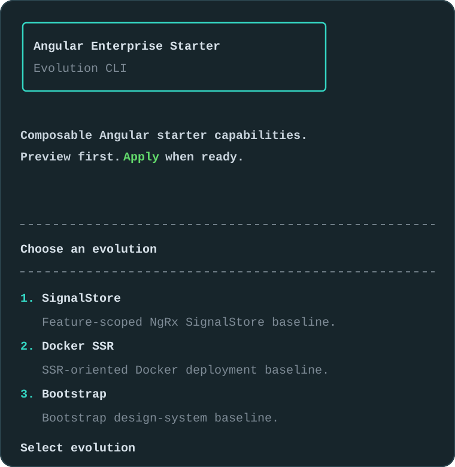

# Evolution CLI

## Index

- [Purpose](#purpose)
- [Recommended flow](#recommended-flow)
- [Usage channels](#usage-channels)
- [Installable evolutions](#installable-evolutions)
- [Command usage](#command-usage)
- [Installer guides](#installer-guides)
- [Safety model](#safety-model)
- [Future parametrized installers](#future-parametrized-installers)
- [Maintenance rules](#maintenance-rules)
- [Tooling structure](#tooling-structure)
- [Quality checks](#quality-checks)

## Purpose

The Evolution CLI is the guided installation layer for Angular Enterprise Starter.

It keeps `main` minimal while allowing users to add selected capabilities through a safer, preview-first workflow.
When an installer exists, the CLI is the recommended installation path because it provides more behavior than a raw `evo/*` branch merge.

```text
main baseline
  + guided Evolution CLI
  + compatible evo/* reference branches
  = modular starter
```

Compared with using a branch directly, a CLI installer can:

- ask for project-specific options;
- show a preview before writing files;
- create only the selected pieces;
- skip already installed pieces when safe;
- stop on partial or ambiguous project state;
- keep starter metadata aligned.

The CLI is intended for projects based on Angular Enterprise Starter.
It is not designed to patch arbitrary Angular applications, where existing architecture and naming conventions may conflict.

Installers do not generate documentation files.
Canonical documentation remains maintained in the repository docs and should be updated separately when a capability changes.

## Recommended flow

Start with the interactive command:

```bash
npm run starter:evolution
```



Recommended flow:

```text
preview -> review impact -> apply
```

Preview should be the default workflow during development.
Apply should be used only after the generated changes are understood.

## Usage channels

The Evolution CLI can be used through two channels.

| Channel             | Command                                                            | Best for                                                                 |
| ------------------- | ------------------------------------------------------------------ | ------------------------------------------------------------------------ |
| Local starter tools | `npm run starter:evolution`                                        | Maintainers and fresh clones that still keep the local installer source. |
| Versioned package   | `npx @filippolacagnina/angular-enterprise-starter@alpha evolution` | Product repositories that removed local installer tooling.               |

The versioned package is the long-term consumer path.
It lets teams remove local schematic sources from their product repository while still receiving newer installer behavior through npm.
The package executes the bundled schematics directly, so it does not require a local `ng generate` command or preinstalled `node_modules` in the target workspace.

When testing a local package build before publishing, use the generated tarball:

```bash
npm run evolution-cli:pack
npm --cache /private/tmp/aes-npm-cache exec \
  --package ./dist/filippolacagnina-angular-enterprise-starter-0.7.0-alpha.0.tgz \
  -- angular-enterprise-starter evolution --name bootstrap --preview
```

## Installable evolutions

| Evolution      | Name             | Status      | Guide                                      | Notes                                                     |
| -------------- | ---------------- | ----------- | ------------------------------------------ | --------------------------------------------------------- |
| Transloco      | `transloco`      | installable | [Guide](./evolution-cli/transloco.md)      | Runtime i18n baseline with EN/IT assets.                  |
| Runtime Config | `runtime-config` | installable | [Guide](./evolution-cli/runtime-config.md) | Deployable values.yml configuration baseline.             |
| SignalStore    | `signal-store`   | installable | [Guide](./evolution-cli/signal-store.md)   | Parametrized feature/root store generation.               |
| Docker SSR     | `docker-ssr`     | installable | [Guide](./evolution-cli/docker-ssr.md)     | SSR-oriented Docker deployment baseline.                  |
| Bootstrap      | `bootstrap`      | installable | [Guide](./evolution-cli/bootstrap.md)      | Parametrized Bootstrap UI primitive generation.           |
| Tailwind       | `tailwind`       | installable | [Guide](./evolution-cli/tailwind.md)       | Parametrized Tailwind UI primitive generation.            |
| AI Genkit      | `ai-genkit`      | installable | [Guide](./evolution-cli/ai-genkit.md)      | Server AI foundation and explicit opt-in summary example. |

Other evolutions may exist as `evo/*` branches before they become CLI-installable.
Those branches remain useful as implementation references, but they should not be treated as CLI installers until an installer, preview metadata and tests exist.

When both options are available, prefer the CLI for day-to-day installation and use the `evo/*` branch as the reference implementation to inspect or merge manually when needed.

For real product baselines, choose one primary design-system evolution.
Temporary test branches may combine installers to validate CLI behavior, but consumer projects should avoid mixing multiple design-system CSS frameworks unless that integration is explicitly owned.

## Command usage

Interactive mode:

```bash
npm run starter:evolution
```

Package mode:

```bash
npx @filippolacagnina/angular-enterprise-starter@alpha evolution
```

Version check:

```bash
npm run starter:evolution -- --version
npx @filippolacagnina/angular-enterprise-starter@alpha --version
```

Preview examples:

```bash
npm run starter:evolution -- --name signal-store --preview
npm run starter:evolution -- --name transloco --preview
npm run starter:evolution -- --name runtime-config --preview
npm run starter:evolution -- --name docker-ssr --preview
npm run starter:evolution -- --name bootstrap --preview
npm run starter:evolution -- --name tailwind --preview
npm run starter:evolution -- --name ai-genkit --preview
npx @filippolacagnina/angular-enterprise-starter@alpha evolution --name bootstrap --preview
```

Apply examples:

```bash
npm run starter:evolution -- --name signal-store --apply
npm run starter:evolution -- --name transloco --apply
npm run starter:evolution -- --name runtime-config --apply
npm run starter:evolution -- --name docker-ssr --apply
npm run starter:evolution -- --name bootstrap --apply
npm run starter:evolution -- --name tailwind --apply
npm run starter:evolution -- --name ai-genkit --apply
```

Non-interactive apply examples:

```bash
npm run starter:evolution -- --name signal-store --apply --yes
npm run starter:evolution -- --name transloco --apply --yes
npm run starter:evolution -- --name runtime-config --apply --yes
npm run starter:evolution -- --name docker-ssr --apply --yes
npm run starter:evolution -- --name bootstrap --apply --yes
npm run starter:evolution -- --name tailwind --apply --yes
npm run starter:evolution -- --name ai-genkit --apply --yes --ai-example summary
```

Use `--yes` only after validating the command in preview mode or inside a temporary test workspace.
Installer-specific options are documented in the dedicated guides.

## Installer guides

Detailed installer behavior lives in dedicated files to keep this guide readable:

| Installer      | Guide                                               | Reference branch              |
| -------------- | --------------------------------------------------- | ----------------------------- |
| Transloco      | [Transloco](./evolution-cli/transloco.md)           | `evo/i18n/transloco`          |
| Runtime Config | [Runtime Config](./evolution-cli/runtime-config.md) | `evo/config/runtime-config`   |
| SignalStore    | [SignalStore](./evolution-cli/signal-store.md)      | `evo/state/signal-store`      |
| Docker SSR     | [Docker SSR](./evolution-cli/docker-ssr.md)         | `evo/deployment/docker-ssr`   |
| Bootstrap      | [Bootstrap](./evolution-cli/bootstrap.md)           | `evo/design-system/bootstrap` |
| Tailwind       | [Tailwind](./evolution-cli/tailwind.md)             | `evo/design-system/tailwind`  |
| AI Genkit      | [AI Genkit](./evolution-cli/ai-genkit.md)           | `evo/ai/genkit`               |

Use `docs/evolution-cli/*` for CLI behavior.
Use `docs/evolutions/*` for branch reference documentation.

## Safety model

The CLI follows a conservative safety model:

- preview before writing files;
- stop before overwriting generated targets;
- do not modify existing components;
- do not silently resolve ambiguous project structure;
- ask for explicit choices when a parametrized installer needs them;
- run preflight guards before destructive configuration changes;
- keep reference branches available for manual inspection.

Expected user-action conflicts stop with a direct message.
Examples:

- a feature SignalStore already exists;
- a root SignalStore with the same name already exists;
- a required feature route is missing;
- feature component files already exist while using `--feature-component create`;
- runtime config files already exist;
- Runtime Config detects custom `APP_CONFIG`, `@core/config` or environment-file references;
- selected design-system component files are partially installed;
- Docker SSR files already exist.
- AI Genkit core, provider adapter or summary files are only partially installed;
- the `/api/ai` route is already owned by another implementation;
- server-side AI environment configuration is incomplete.

Unexpected installer failures include the related `evo/*` reference branch so the user can inspect or merge manually if needed.

## Future parametrized installers

SignalStore, Bootstrap and Tailwind prove the parametrized installer model.
Future parametrized installers should use the same safety principles and document choices in dedicated files under `docs/evolution-cli/`.

Example:

```text
Which evolution?
- Angular Material

Angular Material setup?
- Install baseline only
- Install UI primitives

UI primitives?
- All
- Select manually

Select primitives:
- Button
- Input
- Card
```

Parametrized installers should prefer explicit choices over hidden assumptions.
They must keep preview mode accurate before writing files.

## Maintenance rules

Every CLI installer must stay aligned with its reference branch.

When an `evo/*` branch changes, check whether a CLI installer exists for that evolution.
If it exists, update:

- installer implementation;
- preview metadata;
- CLI evolution list;
- tests;
- `docs/schematics.md` when the installer list changes;
- the related `docs/evolution-cli/*` guide.

When installer behavior changes and the package is intended for consumers, also rebuild and publish a new npm package version.

Current CLI/reference branch mapping:

| Evolution      | Reference branch              | CLI guide                                  |
| -------------- | ----------------------------- | ------------------------------------------ |
| Transloco      | `evo/i18n/transloco`          | [Guide](./evolution-cli/transloco.md)      |
| Runtime Config | `evo/config/runtime-config`   | [Guide](./evolution-cli/runtime-config.md) |
| SignalStore    | `evo/state/signal-store`      | [Guide](./evolution-cli/signal-store.md)   |
| Docker SSR     | `evo/deployment/docker-ssr`   | [Guide](./evolution-cli/docker-ssr.md)     |
| Bootstrap      | `evo/design-system/bootstrap` | [Guide](./evolution-cli/bootstrap.md)      |
| Tailwind       | `evo/design-system/tailwind`  | [Guide](./evolution-cli/tailwind.md)       |

Reference-only branches that are not CLI-installable yet must remain documented in `docs/evolutions.md` until their installers are implemented.

## Tooling structure

Schematics-related tooling lives under:

```text
tools/schematics/
tools/evolution-cli-package/
```

Main areas:

| Path                                           | Purpose                                               |
| ---------------------------------------------- | ----------------------------------------------------- |
| `tools/schematics/starter-evolution.mjs`       | Local and packaged Evolution CLI wrapper.             |
| `tools/schematics/evolution/`                  | Angular schematic entrypoint and schema.              |
| `tools/schematics/evolutions/`                 | Installer implementations and registry.               |
| `tools/schematics/evolutions/ai-genkit/files/` | Versioned files generated by the AI Genkit installer. |
| `tools/schematics/evolutions/design-system/`   | Shared design-system installer utilities.             |
| `tools/schematics/shared/`                     | Shared schematic utilities.                           |
| `tools/schematics/schematics.spec.ts`          | Schematic tests.                                      |
| `tools/evolution-cli-package/`                 | npm package template for the versioned CLI bundle.    |

The cleanup tool remains outside `tools/schematics/` because it is starter-maintenance tooling, not schematic installation tooling.

## Quality checks

After changing schematics, CLI behavior or CLI documentation, run:

```bash
npm run schematics:build
npm run schematics:test
npm run evolution-cli:pack
npm run format:check
npm run lint
```

Recommended preview smoke checks:

```bash
npm run starter:evolution -- --name transloco --preview
npm run starter:evolution -- --name runtime-config --preview
npm run starter:evolution -- --name bootstrap --preview
npm run starter:evolution -- --name bootstrap --preview --bootstrap-mode select --bootstrap-components button,input
npm run starter:evolution -- --name tailwind --preview
npm run starter:evolution -- --name tailwind --preview --tailwind-mode select --tailwind-components button,input
npm run starter:evolution -- --name docker-ssr --preview
npm run starter:evolution -- --name signal-store --preview --store-scope feature --feature-name dashboard
npm run starter:evolution -- --name signal-store --preview --store-scope root --store-name session
npm run starter:evolution -- --name ai-genkit --preview
npm run starter:evolution -- --name ai-genkit --preview --ai-example summary
```

Recommended package smoke checks:

```bash
npm --cache /private/tmp/aes-npm-cache exec \
  --package ./dist/filippolacagnina-angular-enterprise-starter-0.7.0-alpha.0.tgz \
  -- angular-enterprise-starter evolution --name transloco --preview

npm --cache /private/tmp/aes-npm-cache exec \
  --package ./dist/filippolacagnina-angular-enterprise-starter-0.7.0-alpha.0.tgz \
  -- angular-enterprise-starter evolution --name runtime-config --preview

npm --cache /private/tmp/aes-npm-cache exec \
  --package ./dist/filippolacagnina-angular-enterprise-starter-0.7.0-alpha.0.tgz \
  -- angular-enterprise-starter evolution --name bootstrap --preview --bootstrap-mode select --bootstrap-components button,input

npm --cache /private/tmp/aes-npm-cache exec \
  --package ./dist/filippolacagnina-angular-enterprise-starter-0.7.0-alpha.0.tgz \
  -- angular-enterprise-starter evolution --name tailwind --preview --tailwind-mode select --tailwind-components button,input

npm --cache /private/tmp/aes-npm-cache exec \
  --package ./dist/filippolacagnina-angular-enterprise-starter-0.7.0-alpha.0.tgz \
  -- angular-enterprise-starter evolution --name ai-genkit --preview --ai-example summary
```

For real apply testing, use a temporary copy of the repository, then run:

```bash
npm install
npm run format:check
npm run lint
npm run build
```
